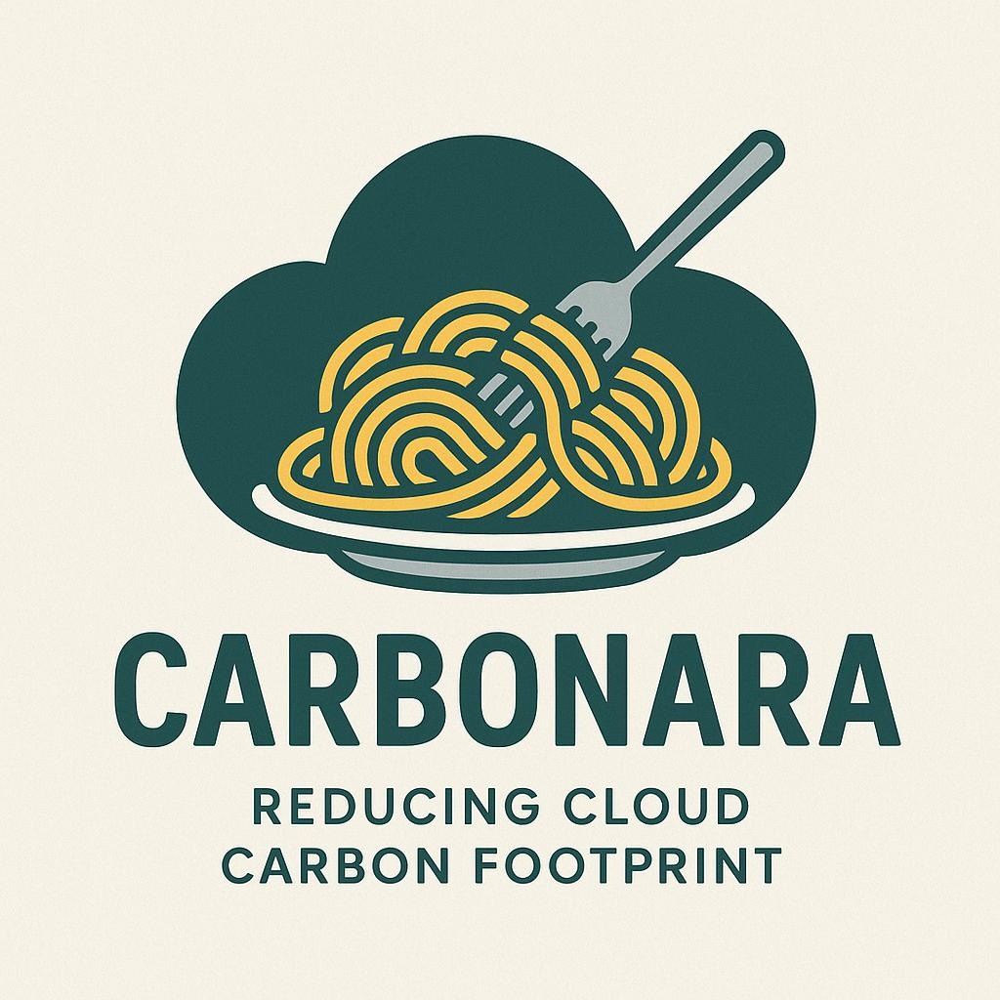

# CARBONARA



*Carbonara* helps estimate the environmental impact of your cloud usage. By leveraging open source models and data, it enriches
usage reports generated by cloud providers and allows you to build reports and visualisations. Having the greenops and finops data in the same 
place makes it easier to expose your costs and impacts side by side.

*Carbonara* uses [Apache Spark](https://spark.apache.org/) to read and write the usage reports (typically in Parquet format) in a scalable way and, thanks to its modular approach, 
splits the enrichment of the data into configurable stages.

A typical sequence of stages would be:
- estimation of embedded emissions from resources used
- estimation of energy used
- application of PUE and other overheads
- application of carbon intensity factors

Please note that this is currently a prototype which handles only CUR reports from AWS. Not all AWS services are covered.

One of the benefits of using Apache Spark is that you can use [EMR on AWS](https://aws.amazon.com/emr/features/spark/) to enrich 
the CURs at scale without having to export or expose any of your data.

## Local install

With Apache Spark installed locally and added to the $PATH.

```
mvn clean package
spark-submit --class com.digitalpebble.carbonara.SparkJob --driver-memory 2g ./target/carbonara-1.0.jar ./curs ./output
```

## Docker

Build the Docker image with
`docker build -t carbonara:1.0 .`

The command below processes the data locally by mounting the directories containing the CURs and output as volumes:
```
docker run -it  -v ./curs:/curs -v ./output:/output  carbonara:1.0 \
/opt/spark/bin/spark-submit  \
--class com.digitalpebble.carbonara.SparkJob \
--master 'local[*]' \
/usr/local/lib/carbonara-1.0.jar \
/curs /output
```
