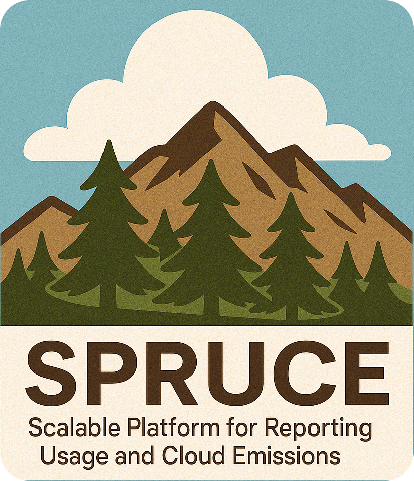

  

# SPRUCE

**SPRUCE** helps estimate the environmental impact of your cloud usage. By leveraging open source models and data, it enriches
usage reports generated by cloud providers and allows you to build reports and visualisations. Having the GreenOps and FinOps data in the same 
place makes it easier to expose your costs and impacts side by side.

Please note that SPRUCE handles only CUR reports from AWS and not all their services are covered. However, most of the cost from a typical usage already gets estimates.

**SPRUCE** uses [Apache Spark®](https://spark.apache.org/) to read and write the usage reports (typically in Parquet format) in a scalable way and, thanks to its modular approach, 
splits the enrichment of the data into configurable stages.

A typical sequence of stages would be:
- estimation of embodied emissions from the hardware
- estimation of energy used
- application of PUE and other overheads
- application of carbon intensity factors

Have a look at the [methodology section](https://opensourcegreenops.cloud/methodology.html) of our documentation for more details.

## Documentation 

The documentation is at https://opensourcegreenops.cloud/. If you can't wait to try SPRUCE, have a look at the [tutorial for Docker](https://opensourcegreenops.cloud/tutorial/with-docker.html).

## License
Licensed under the Apache License, Version 2.0: http://www.apache.org/licenses/LICENSE-2.0

## Contributing
We welcome contributions to the project, see [CONTRIBUTING.md](CONTRIBUTING.md) for instructions on how to do so. Contributions are not only about code: by testing the project on your data, talking about it or asking questions, you will be contributing too!

## Support
Do you need help with SPRUCE? Want some bespoke work, training or a workshop? We at [DigitalPebble](https://digitalpebble.com/), provide consulting services for SPRUCE. 
Send us an email at _spruce@digitalpebble.com_!

