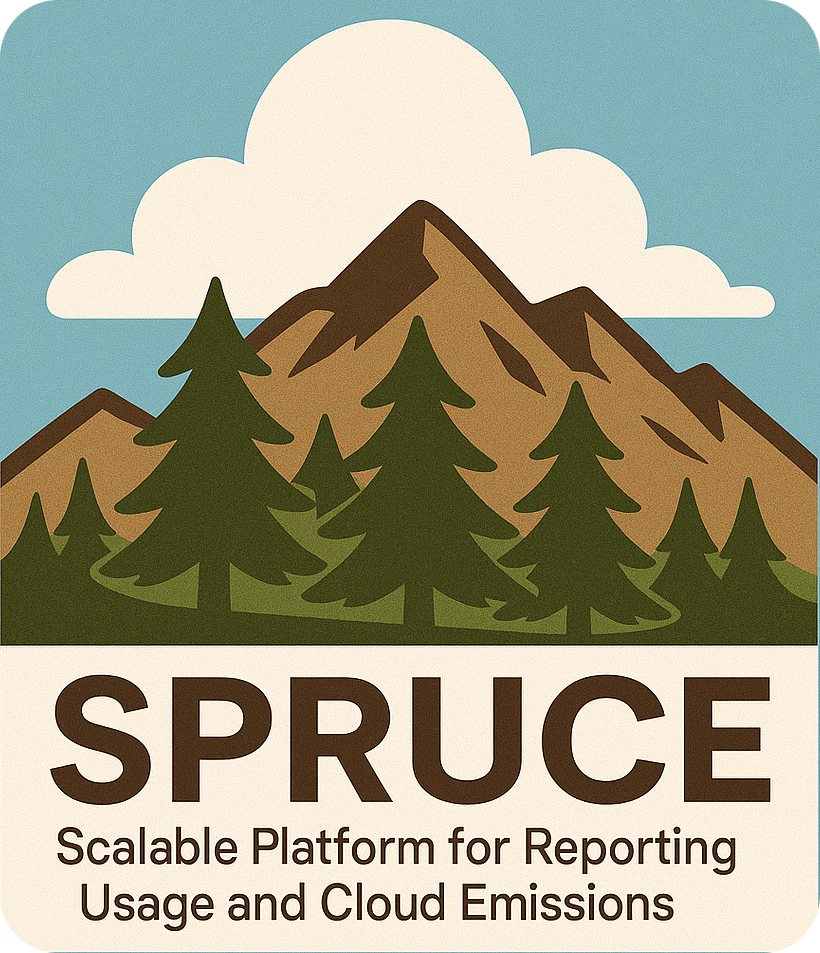

  

# SPRUCE

**SPRUCE** helps estimate the environmental impact of your cloud usage. By leveraging open source models and data, it enriches
usage reports generated by cloud providers and allows you to build reports and visualisations. Having the GreenOps and FinOps data in the same
place makes it easier to expose your costs and impacts side by side.

## Why SPRUCE?

Cloud providers do report environmental impact — but at a level of aggregation that makes it impossible to act on. Figures are rolled up at account or service level, cover carbon at best, and sit entirely separate from your cost data. They tell you how you're doing; they don't help you do better.

SPRUCE is built around the idea that actionable GreenOps requires the same granularity as FinOps:

- **Resource-level detail** — identify which workloads, teams, or environments are driving your footprint, not just your bill.
- **Multiple impact dimensions** — beyond carbon, SPRUCE models water consumption, giving a fuller picture of your cloud's environmental cost.
- **GreenOps and FinOps together** — cost and impact share the same pipeline, so trade-off decisions are grounded in real data.
- **Open and auditable** — built on open source models and public data, so your methodology is transparent, not black-boxed.
- **Standards-friendly** — ingests [FOCUS](https://focus.finops.org/) exports from AWS and Azure, and outputs FOCUS-compatible columns.
- **Your data stays yours** — running on EMR means your CUR data never leaves your AWS environment.
- **Actively maintained** — unlike Cloud Carbon Footprint, which has been abandoned, SPRUCE is under active development.

SPRUCE enriches the billing exports you already produce, in the provider's native format or in the provider-neutral [FOCUS](https://focus.finops.org/) format (`-f FOCUS`):

| Provider | Native format | FOCUS | Coverage |
|---|---|---|---|
| **AWS** | ✅ CUR v2 (Parquet) | ✅ 1.2 | Most of the cost of a typical usage gets estimates |
| **Azure** | ✅ EA/MCA cost details (CSV) | ✅ 1.0 | Partial — basic services covered, actively expanding |

## How it works

**SPRUCE** uses [Apache Spark®](https://spark.apache.org/) to read and write the usage reports (typically in Parquet format) in a scalable way and, thanks to its modular approach,
splits the enrichment of the data into configurable stages.

A typical sequence of stages would be:
- estimation of embodied emissions from the hardware
- estimation of energy used
- estimation of water consumption
- application of PUE / WUE and other overheads
- application of carbon intensity factors

Have a look at the [methodology section](https://opensourcegreenops.cloud/methodology.html) of our documentation for more details.

## Documentation 

The documentation is at https://opensourcegreenops.cloud/. If you can't wait to try SPRUCE, have a look at the [tutorial for Docker](https://opensourcegreenops.cloud/tutorial/with-docker.html).

To explore enriched output, see
[Explore the results](https://opensourcegreenops.cloud/tutorial/results.html)
and [Build a simple dashboard](https://opensourcegreenops.cloud/howto/dashboard.html).

## License
Licensed under the Apache License, Version 2.0: http://www.apache.org/licenses/LICENSE-2.0

## Contributing
We welcome contributions to the project, see [CONTRIBUTING.md](CONTRIBUTING.md) for instructions on how to do so. Contributions are not only about code: by testing the project on your data, talking about it or asking questions, you will be contributing too!

## Support
Do you need help with SPRUCE? Want some bespoke work, training or a workshop? Would you like someone to run it for you on your data?

[DigitalPebble](https://digitalpebble.com/) provide consulting services for SPRUCE, send us an email at _spruce@digitalpebble.com_.

