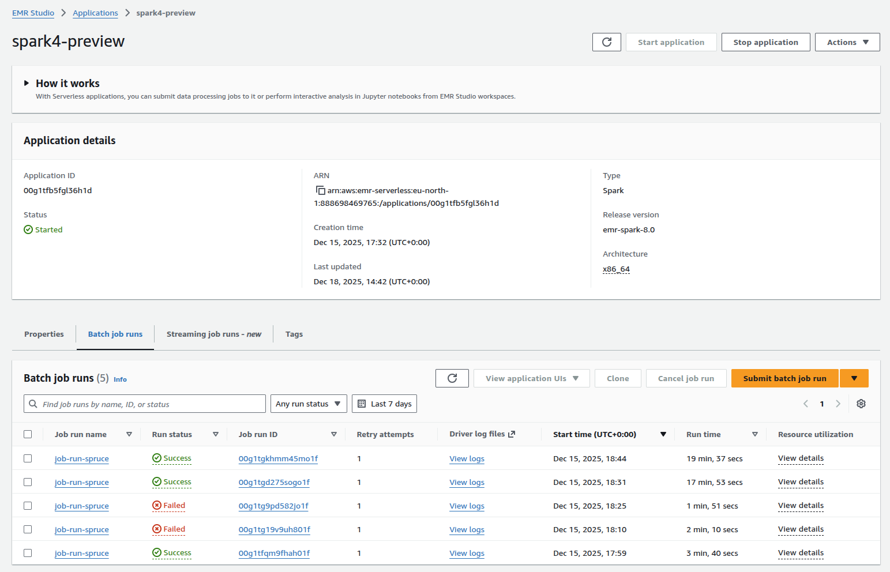

# Run SPRUCE on AWS EMR Serverless

One of the benefits of using SPRUCE is that you can enrich usage reports within AWS without having to expose any of your data to an API or external service.

The easiest way to do this is by running it on [AWS EMR Serverless](https://docs.aws.amazon.com/emr/latest/EMR-Serverless-UserGuide). EMR Serverless is a fully 
managed, on-demand service that lets you run [Apache Spark®](https://spark.apache.org/) without provisioning or managing clusters. You simply submit your jobs, and EMR Serverless automatically provisions, scales, and shuts down the required resources.
You pay only for the compute and memory used while your jobs run, making it ideal for episodic, variable, or exploratory data processing workloads.

Since AWS CUR reports are stored on S3, it makes perfect them to enrich them straight from there without having to copy them.

EMR is also designed to scale, if your CUR reports are large, this is a good way of enriching them.

[EMR-Spark-8](https://docs.aws.amazon.com/emr/latest/EMR-Serverless-UserGuide/release-version-emr-spark-8.0-preview.html) ships with a version of Apache Spark compatible with what SPRUCE uses.

## Setup

Follow these [instructions](https://docs.aws.amazon.com/emr/latest/EMR-Serverless-UserGuide/setting-up.html) to set up EMR Serverless on your AWS account.
You will also need to install the AWS CLI and have configured it.

We will assume that you have CUR reports on S3. You will also need to make the SPRUCE jar available to EMR by placing it in a S3 bucket.
You can either compile the JAR from the SPRUCE code or grab the one from [the release page](https://github.com/DigitalPebble/spruce/releases/download/0.7/spruce-0.7.jar).
In the example below, we put it in `s3://spruce-jars/spruce-0.7.jar` but since that bucket name is now taken, you will have to choose a different one.

## Run on EMR

Have a look at the [user guide](https://docs.aws.amazon.com/emr/latest/EMR-Serverless-UserGuide/gs-cli.html).

From the CLI

`aws emr-serverless create-application --type spark --release-label emr-spark-8.0-preview --name spark4-SPRUCE`

Note the application ID returned in the output. You can always find it with `aws emr-serverless list-applications`.

Check that the application has been created with 

```
aws emr-serverless get-application \
    --application-id application-id
```

Next, you launch a job

```
aws emr-serverless start-job-run \
    --application-id application-id \
    --execution-role-arn job-role-arn \
    --name job-run-name \
    --job-driver '{
        "sparkSubmit": {
          "entryPoint": "s3://spruce-jars/spruce-0.7.jar",
          "entryPointArguments": [
             "-i", "s3:/INPUT-curs/","-o","s3://spruce-output/"
          ],
          "sparkSubmitParameters": "--conf spark.executor.cores=1 --conf spark.executor.memory=4g --conf spark.driver.cores=1 --conf spark.driver.memory=4g --conf spark.executor.instances=1"
        }
    }'
```

where `application-id` is the one you got when creating the application above.
`entryPoint` is the location of the SPRUCE jar. The _entryPointArguments_ are where you specify the inputs and outputs of SPRUCE, as explained in the [tutorial](../tutorial/with-spark.html).

Note the _job run ID_ returned in the output.

## Check the results

Depending on the size of your CUR reports, the enrichment will take more or less time. You can check that it has completed with 

```
aws emr-serverless get-job-run \
    --application-id application-id \
    --job-run-id job-run-id
```

Look at the tutorial, for examples of how to [query](tutorial/results.html) the enriched usage reports.

## Use the AWS Console

You can of course run EMR using the [AWS console](https://docs.aws.amazon.com/emr/latest/EMR-Serverless-UserGuide/gs-console.html). This makes it easier to check the success of a job and access the logs for it.




