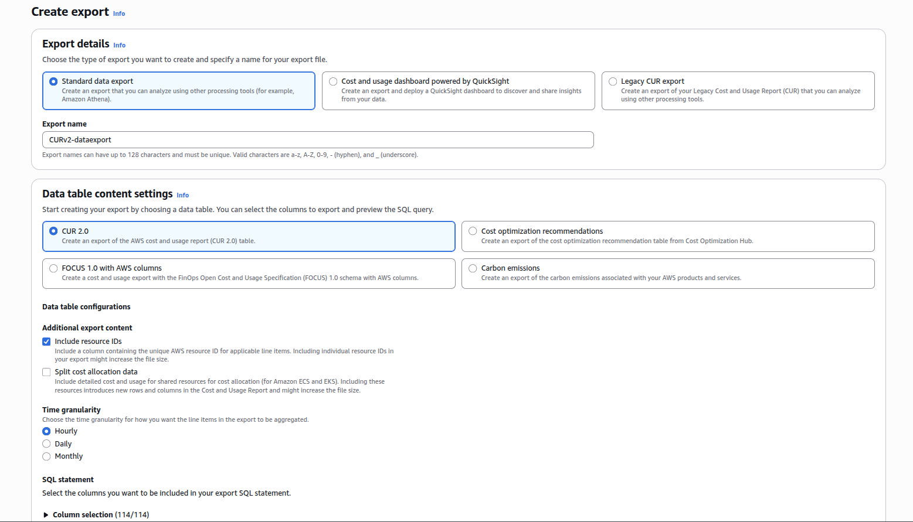
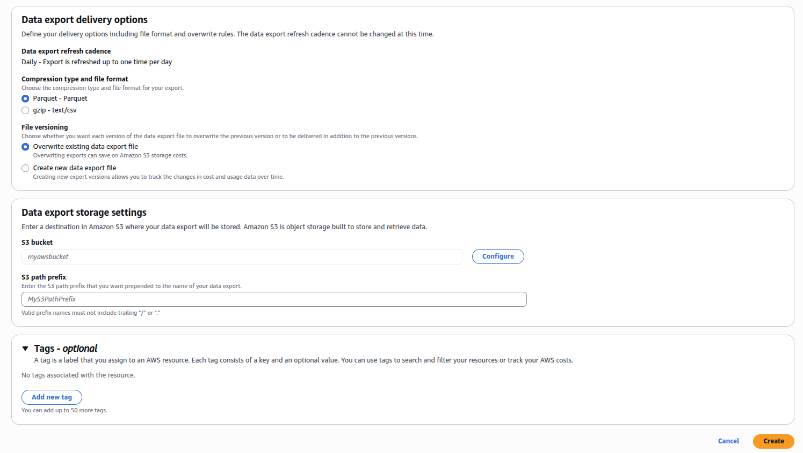

# Generate CUR reports

You will need to have CUR reports as inputs. Those are generated via [Data Exports](https://docs.aws.amazon.com/cur/latest/userguide/what-is-data-exports.html) and stored on S3 as Parquet files.

The **Data Export** will automatically populate the CURv2 reports. You can open a support ticket with AWS to get the reports backfilled with historical data.


## AWS Console

In the **Billing and Cost Management** section, go to **Cost and Usage Analysis** then **Data Export**. Click on **Create**:

Give your export a name, click on **Include Resource IDs** as shown below



Scroll down to **Data export storage settings**, select a S3 bucket and a prefix. 
If you create a bucket, you should select a region with a low carbon intensity like `eu-north-1` (Sweden) or `eu-west-3` (France), the emissions related to the storage of the reports will be greatly reduced.




Optionally, add **Tags** to track the cost and impacts of your GreenOps activities.

## Command line

Make sure your AWS keys are exported as environment variables

```
eval "$(aws configure export-credentials --profile default --format env)"
```

Copy the script [createCUR.sh](https://github.com/DigitalPebble/spruce/blob/main/createCUR.sh) and run it on the command line. You will be asked to enter a `region` for the S3 bucket, a `bucket` name and a `prefix`.

This should create the bucket where the CUR reports will be stored and configure the Data Export for the CURs.
