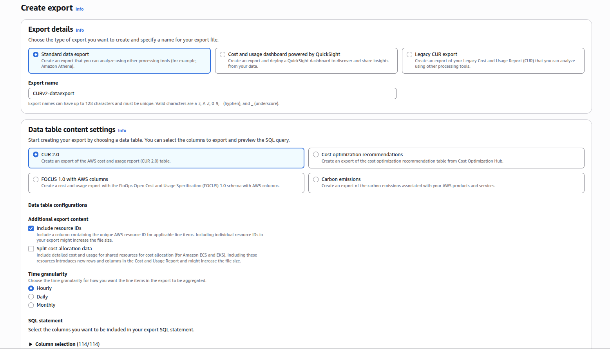
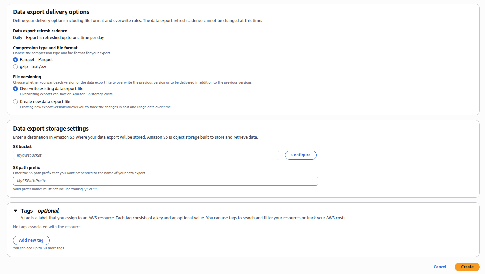

# Generate usage reports

SPRUCE takes the billing exports produced by the cloud providers as input, either in the
provider's native format or in the provider-neutral [FOCUS 1.0](https://focus.finops.org/)
format:

- **AWS CUR v2** (Parquet) — the default input (`-p AWS -f NATIVE`)
- **AWS FOCUS 1.0** (Parquet) — `-p AWS -f FOCUS`
- **Azure FOCUS 1.0** (CSV) — `-p AZURE -f FOCUS`
- **Azure EA/MCA cost details** (CSV) — `-p AZURE -f NATIVE`

This page explains how to set up each export. In all cases you can ask the provider to
backfill historical data: AWS via a support ticket, Azure by creating a one-time export for
past billing periods.

## AWS

AWS exports are generated via [Data Exports](https://docs.aws.amazon.com/cur/latest/userguide/what-is-data-exports.html)
and stored on S3 as Parquet files. Data Exports can produce both the CUR v2 table and a
**FOCUS 1.0 with AWS columns** table — the steps below are the same, only the export type
differs.

### AWS Console

In the **Billing and Cost Management** section, go to **Cost and Usage Analysis** then **Data Export**. Click on **Create**.

Select the export type: **Standard data export** with the **CUR 2.0** table for a native CUR,
or the **FOCUS 1.0 with AWS columns** table for a FOCUS export.

Give your export a name and, for a CUR, click on **Include Resource IDs** as shown below



Scroll down to **Data export storage settings**, select a S3 bucket and a prefix. 
If you create a bucket, you should select a region with a low carbon intensity like `eu-north-1` (Sweden) or `eu-west-3` (France), the emissions related to the storage of the reports will be greatly reduced.




Optionally, add **Tags** to track the cost and impacts of your GreenOps activities.

### Command line

Make sure your AWS keys are exported as environment variables

```shell
eval "$(aws configure export-credentials --profile default --format env)"
```

Copy the script [createCUR.sh](https://github.com/DigitalPebble/spruce/blob/main/createCUR.sh) and run it on the command line. You will be asked to enter a `region` for the S3 bucket, a `bucket` name and a `prefix`.

This should create the bucket where the CUR reports will be stored and configure the Data Export for the CURs.

## Azure

Azure exports are generated via [Cost Management exports](https://learn.microsoft.com/en-us/azure/cost-management-billing/costs/tutorial-improved-exports)
and delivered as CSV files to a storage account.

In the Azure portal, go to **Cost Management**, select **Exports** and click on **Create**.
Pick the dataset:

- **Cost and usage details (FOCUS)** for a FOCUS 1.0 export — the recommended option for SPRUCE
- **Cost and usage details (actual)** for the legacy EA/MCA cost details format

Choose the frequency (a daily export of the month-to-date costs is a good default), a storage
account and a container, then create the export. Use **Export selected dates** to backfill
past billing periods.

Download the CSV files from the storage account (e.g. with [azcopy](https://learn.microsoft.com/en-us/azure/storage/common/storage-use-azcopy-v10))
and pass the directory to SPRUCE with `-p AZURE -f FOCUS` (or `-f NATIVE` for the legacy format).
