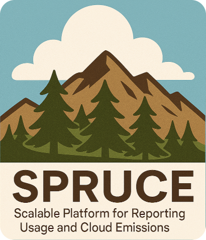

**SPRUCE** helps estimate the environmental impact of your cloud usage. By leveraging open source models and data, it enriches
usage reports generated by cloud providers and allows you to build reports and visualisations. Having the GreenOps and FinOps data in the same
place makes it easier to expose your costs and impacts side by side.

Please note that SPRUCE handles only CUR reports from AWS and not all their services are covered. However, most of the cost from a typical usage already gets estimates.

**SPRUCE** uses [Apache Spark®](https://spark.apache.org/) to read and write the usage reports (typically in Parquet format) in a scalable way and, thanks to its modular approach,
splits the enrichment of the data into configurable stages.

A typical sequence of stages would be:
- estimation of embodied emissions from the hardware
- estimation of energy used
- application of PUE and other overheads
- application of carbon intensity factors

Have a look at the [methodology section](methodology.md) for more details.

One of the benefits of using Apache Spark is that you can use [EMR on AWS](https://aws.amazon.com/emr/features/spark/) to enrich
the CURs at scale without having to export or expose any of your data.

The code of the project is in our [GitHub repo](https://github.com/DigitalPebble/spruce/).

Spruce is licensed under the [Apache License, Version 2.0](http://www.apache.org/licenses/LICENSE-2.0).
