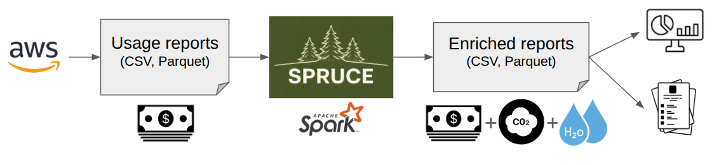

# Methodology

SPRUCE uses third-party resources and models to estimate the environmental impact of cloud services. It enriches cost usage reports (CUR) with additional columns, allowing users to do GreenOps and build dashboards and reports.

Unlike the information provided by CSPs (Cloud Service Providers), SPRUCE gives total transparency on how the estimates are built.

The overall approach is as follows:
1. Estimate the energy used per activity (e.g. for X GB of data transferred, usage of an EC2 instance, storage etc.)
2. Add overheads (e.g. PUE, WUE)
3. Estimate water consumption (cooling and electricity generation)
4. Apply accurate carbon intensity factors - ideally for a specific location at a specific time
5. Where possible, estimate the embodied carbon related to the activity

This is compliant with the [SCI specification](https://sci.greensoftware.foundation/) from the GreenSoftware Foundation.

The main columns added by SPRUCE are:
* `operational_energy_kwh`: amount of energy in kWh needed for using the corresponding service. 
* `operational_emissions_co2eq_g`: emissions of CO2 eq in grams from the energy usage.
* `embodied_emissions_co2eq_g`: emissions of CO2 eq in grams embodied in the hardware used by the service, i.e. how much did it take to produce it.

The total emissions for a service are `operational_emissions_co2eq_g` + `embodied_emissions_co2eq_g`.

SPRUCE also estimates water consumption:
* `water_cooling_l`: volume of water in litres used for data centre cooling.
* `water_electricity_production_l`: volume of water in litres consumed during electricity generation.
* `water_consumption_stress_area_l`: total water consumption attributed to regions under high or extremely high water stress.

See the [enrichment modules](modules.md) page for details on how each estimate is computed.

