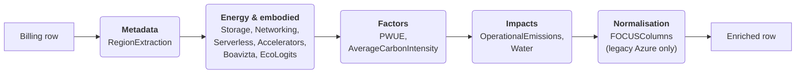

# Enrichment modules

SPRUCE generates its estimates by chaining **EnrichmentModules**.
An `EnrichmentModule` is the unit of extension in SPRUCE. Each module reads columns from
the CUR input row and/or from values set by earlier modules, then writes its results into a
shared map. The pipeline materialises one output row per CUR row at the end, avoiding
per-module row copies.

The enrichment modules are listed and configured in a configuration file, one per cloud provider and report format. If no configuration is specified, SPRUCE uses the bundled default for the active provider (e.g. [`default-config-aws.json`](https://github.com/DigitalPebble/spruce/blob/main/src/main/resources/default-config-aws.json) for a native AWS CUR, or [`default-config-aws-focus.json`](https://github.com/DigitalPebble/spruce/blob/main/src/main/resources/default-config-aws-focus.json) / [`default-config-azure-focus.json`](https://github.com/DigitalPebble/spruce/blob/main/src/main/resources/default-config-azure-focus.json) for an AWS or Azure [FOCUS](https://focus.finops.org/) report).
See [Configure the modules](howto/config_modules.md) for instructions on how to modify the enrichment modules, and [Write a module](howto/write_module.md) to add your own.
The list of columns generated by the modules can be found in the [SpruceColumn](https://github.com/DigitalPebble/spruce/blob/main/src/main/java/com/digitalpebble/spruce/SpruceColumn.java) class.

!!! note "Native and FOCUS report formats"
    A FOCUS export carries mostly the same values as the provider's native export under different
    column names (e.g. for Azure `x_SkuMeterCategory` instead of `MeterCategory`, for AWS `x_Operation`
    instead of `line_item_operation` and `SkuMeter` instead of `line_item_usage_type`). The provider
    modules therefore work for both formats: when the report format is FOCUS, they automatically
    rebind their input columns to the FOCUS names. Two AWS specificities: `x_ServiceCode` carries the
    CUR product code (`line_item_product_code`), and the columns with no FOCUS equivalent are derived
    from `SkuMeter` — the instance type from meters like `BoxUsage:m5.large` and the data transfer
    category from the meter suffixes (`DataTransfer-Regional-Bytes`, `AWS-Out-Bytes`, ...).

## The pipeline at a glance

The modules run in sequence and fall into five stages. Later stages consume the columns
written by earlier ones, which is why the order in the configuration file matters.



| Module | Providers | Writes | Based on |
|---|---|---|---|
| [RegionExtraction](#regionextraction) | AWS, Azure, FOCUS | `region` | — |
| [Storage](#storage) | AWS, Azure | `operational_energy_kwh` | [Cloud Carbon Footprint](https://www.cloudcarbonfootprint.org/) |
| [Networking](#networking) | AWS, Azure | `operational_energy_kwh` | [Boavizta](https://boavizta.org/) coefficients |
| [Serverless](#serverless) | AWS | `operational_energy_kwh` | [Tailpipe](https://tailpipe.ai/methodology/serverless-explained/) |
| [Accelerators](#accelerators) | AWS | `operational_energy_kwh` | [Cloud Carbon Footprint](https://www.cloudcarbonfootprint.org/) |
| [Compute — Boavizta](#compute-boavizta) | AWS, Azure | `operational_energy_kwh`, `embodied_emissions_co2eq_g`, `embodied_adp_sbeq_g` | [BoaviztAPI](https://doc.api.boavizta.org/) |
| [LLM inference — EcoLogits](#llm-inference-ecologits) | AWS | `operational_energy_kwh`, `embodied_emissions_co2eq_g` | [EcoLogits](https://ecologits.ai/) |
| [PWUE](#pwue) | AWS, Azure | `power_usage_effectiveness`, `water_usage_effectiveness` | Provider-published data |
| [AverageCarbonIntensity](#averagecarbonintensity) | AWS, Azure | `carbon_intensity` | [Ember](https://ember-energy.org/) |
| [OperationalEmissions](#operationalemissions) | AWS, Azure | `operational_emissions_co2eq_g` | — |
| [Water](#water) | AWS, Azure | `water_cooling_l`, `water_electricity_production_l`, `water_consumption_stress_area_l` | [WRI](https://www.wri.org/) |
| [FOCUSColumns](#focuscolumns) | Azure (legacy format) | [FOCUS](https://focus.finops.org/) columns | — |

## Stage 1 — Metadata extraction

### RegionExtraction

Extracts the region information from the provider-specific input columns and stores it in
a standard location, where all the following modules can find it. The FOCUS variant is
provider-neutral: it reads the standard `RegionId` column.

| | |
|---|---|
| **Classes** | `com.digitalpebble.spruce.modules.aws.RegionExtraction`<br>`com.digitalpebble.spruce.modules.azure.RegionExtraction`<br>`com.digitalpebble.spruce.modules.focus.RegionExtraction` |
| **Writes** | `region` |

## Stage 2 — Energy and embodied estimates

The modules in this stage estimate the energy used by a row of usage — and, for Boavizta
and EcoLogits, the related embodied emissions. Each module handles a different kind of
usage (storage, networking, compute, …), so they complement each other rather than overlap.

### Storage

Estimates the energy used for storage by applying a flat coefficient per GB, following the
approach of the [Cloud Carbon Footprint](https://www.cloudcarbonfootprint.org/docs/methodology#storage) project.
Service-specific replication factors are applied. On Azure, managed disks are estimated
from their provisioned capacity.

| | |
|---|---|
| **Classes** | `com.digitalpebble.spruce.modules.ccf.aws.Storage`<br>`com.digitalpebble.spruce.modules.ccf.azure.Storage` |
| **Writes** | `operational_energy_kwh` |

**Configuration** (in Wh per TB-hour):

| Key | Default | Description |
|---|---|---|
| `hdd_coefficient_tb_h` | 0.65 | Energy per TB-hour for HDD storage |
| `ssd_coefficient_tb_h` | 1.2  | Energy per TB-hour for SSD storage |

### Networking

Estimates the energy used for networking in and out of data centres. The module
distinguishes between three transfer types with separate coefficients, taken from the
Boavizta Cloud Emissions Working Group.

In a CUR, the transfer type is read from the `transfer_type` product attribute of the
`AWSDataTransfer` lines. A FOCUS report carries neither, so the category is derived from the
`SkuMeter` suffixes instead (`DataTransfer-Regional-Bytes` and `DataTransfer-xAZ-*-Bytes` →
intra, `AWS-*-Bytes` and `CloudFront-*-Bytes` → inter, `DataTransfer-In/Out-Bytes` → external),
which map one-to-one to the CUR transfer types.

| | |
|---|---|
| **Classes** | `com.digitalpebble.spruce.modules.aws.Networking`<br>`com.digitalpebble.spruce.modules.azure.Networking` |
| **Writes** | `operational_energy_kwh` |

**Configuration** — the `network_coefficients_kwh_gb` map (in kWh/GB):

| Transfer type | Key     | Default | Description                                       |
| ------------- | ------- | ------- | ------------------------------------------------- |
| Intra-region  | `intra` | 0.001   | Traffic within the same region                    |
| Inter-region  | `inter` | 0.0015  | Traffic between regions                           |
| External      | `extra` | 0.059   | Traffic to/from the internet (Inbound / Outbound) |

!!! note "Attributing networking emissions"
    The relevance and usefulness of attributing emissions for networking based on usage is
    subject for debate, as the energy use of networking is pretty constant independently of
    traffic. The consequences of reducing networking are probably negligible but since the
    approach in SPRUCE is attributional, we do the same for networking in order to be
    consistent.

### Serverless

Estimates the energy for the memory and vCPU usage of serverless services like Fargate or
EMR. The default coefficients are taken from the [Tailpipe methodology](https://tailpipe.ai/methodology/serverless-explained/).

| | |
|---|---|
| **Class** | `com.digitalpebble.spruce.modules.aws.Serverless` |
| **Writes** | `operational_energy_kwh` |

**Configuration**:

| Key | Default | Description |
|---|---|---|
| `memory_coefficient_kwh`  | 0.0000598     | kWh per GB of memory |
| `arm_cpu_coefficient_kwh` | 0.00191015625 | kWh per vCPU (ARM) |
| `x86_cpu_coefficient_kwh` | 0.0088121875  | kWh per vCPU (x86) |

### Accelerators

Estimates the energy used by accelerators (GPUs), following the approach of the
[Cloud Carbon Footprint](https://www.cloudcarbonfootprint.org/docs/methodology/#graphic-processing-units-gpus)
project: the power draw is interpolated between the minimum and maximum wattage of the
accelerator at an assumed utilisation rate.

| | |
|---|---|
| **Class** | `com.digitalpebble.spruce.modules.ccf.aws.Accelerators` |
| **Writes** | `operational_energy_kwh` |

**Configuration**:

| Key | Default | Description |
|---|---|---|
| `gpu_utilisation_percent` | 50 | Assumed GPU utilisation rate |

### Compute — Boavizta

Estimates the [final energy](https://www.eea.europa.eu/en/analysis/indicators/primary-and-final-energy-consumption)
used for computation (e.g. EC2, OpenSearch, RDS on AWS; virtual machines on Azure), as well
as the related embodied emissions and abiotic resource depletion, using the
[BoaviztAPI](https://doc.api.boavizta.org/).

In a CUR, the instance type is read from `product_instance_type`; a FOCUS report does not carry
it, so it is parsed from the `SkuMeter` column instead (e.g. `EUW2-BoxUsage:t3.xlarge`).

Each provider has two variants:

* **BoaviztAPI** queries a running instance of the API (`docker run -p 5000:5000 ghcr.io/boavizta/boaviztapi:latest`). The address can be set with the `address` configuration key (default `http://localhost:5000`).
* **BoaviztAPIstatic** reads the same information from a static file generated from the API and bundled with SPRUCE. No API instance is needed, which makes it simpler to use — this is the variant enabled in the default configurations.

| | |
|---|---|
| **Classes** | `com.digitalpebble.spruce.modules.boavizta.aws.BoaviztAPI`<br>`com.digitalpebble.spruce.modules.boavizta.aws.BoaviztAPIstatic`<br>`com.digitalpebble.spruce.modules.boavizta.azure.BoaviztAPI`<br>`com.digitalpebble.spruce.modules.boavizta.azure.BoaviztAPIstatic` |
| **Writes** | `operational_energy_kwh`, `embodied_emissions_co2eq_g`, `embodied_adp_sbeq_g` |

??? info "What is Abiotic Depletion Potential (ADP)?"
    From the [BoaviztAPI documentation](https://doc.api.boavizta.org/Explanations/impacts/):

    **Abiotic Depletion Potential (ADP)** is an environmental impact indicator. This category
    corresponds to mineral and resources used and is, in this sense, mainly influenced by the
    rate of resources extracted. The effect of this consumption on their depletion is estimated
    according to their availability stock at a global scale. This impact category is divided
    into two components: a material component and a fossil fuels component (we use a version of
    ADP which includes both). This impact is expressed in grams of antimony equivalent (gSbeq).

    **Source**: [sciencedirect](https://www.sciencedirect.com/topics/engineering/abiotic-depletion-potential)

### LLM inference — EcoLogits

Estimates the energy consumption and embodied emissions of LLM inference on **AWS Bedrock**,
based on static per-model coefficients derived from the [EcoLogits](https://ecologits.ai/)
project. Like `BoaviztAPIstatic`, a static data file bundled in the JAR is loaded at
initialisation time; the module then matches Bedrock CUR rows to per-model coefficients.

The module parses the `line_item_usage_type` field (format:
`{REGION}-{ModelKey}-{input|output}-tokens[-batch]`) to extract both the model key and the
token type, then normalises the token count from `pricing_unit` (handling real-world values
such as `1K tokens` or `1M tokens`). Only output-token rows are scored — the EcoLogits
methodology attributes ~all generation cost to the autoregressive output phase, so
input-token rows are skipped.

| | |
|---|---|
| **Class** | `com.digitalpebble.spruce.modules.ecologits.BedrockEcoLogits` |
| **Writes** | `operational_energy_kwh`, `embodied_emissions_co2eq_g` |

!!! note "Batch size assumption"
    EcoLogits hardcodes a batch size of `B=64` concurrent requests. The resulting
    coefficients are a mid-batch estimate — they underestimate energy for low-traffic
    scenarios and overestimate it for high-throughput batch inference (e.g. Bedrock Batch
    mode). Making `B` dynamic requires provider telemetry not available in billing data.

## Stage 3 — Efficiency and intensity factors

The modules in this stage do not estimate energy themselves; they attach the per-region
factors that the impact modules in the next stage multiply the energy estimates by.

### PWUE

Loads both **Power Usage Effectiveness (PUE)** and **Water Usage Effectiveness (WUE)**
factors from a CSV resource file bundled per provider: [`aws-pue-wue.csv`](https://github.com/DigitalPebble/spruce/blob/main/src/main/resources/aws-pue-wue.csv) uses the 2024 data
[published by AWS](https://sustainability.aboutamazon.com/aws-wue-pue.csv), and
[`azure-pue-wue.csv`](https://github.com/DigitalPebble/spruce/blob/main/src/main/resources/azure-pue-wue.csv) is sourced from [Microsoft's data centre sustainability pages](https://datacenters.microsoft.com/sustainability/efficiency/).

The lookup logic follows this priority:

1. Exact region match (e.g. `us-east-1`)
2. Regex pattern match (e.g. `us-.+`)
3. Default configured value (fallback to 1.15 for PUE, null for WUE)

| | |
|---|---|
| **Class** | `com.digitalpebble.spruce.modules.PWUE` |
| **Reads** | `region` |
| **Writes** | `power_usage_effectiveness`, `water_usage_effectiveness` |

**Configuration**:

| Key | Default | Description |
|---|---|---|
| `default` | 1.15 | PUE used when a region matches neither an exact entry nor a pattern |

### AverageCarbonIntensity

Adds average carbon intensity factors derived from [Ember](https://ember-energy.org/)'s
electricity data, distributed under the [Creative Commons Attribution Licence (CC-BY-4.0)](https://ember-energy.org/creative-commons/).
Values are keyed directly by cloud provider and region (e.g. `aws:us-east-1`). For regions
in countries with sub-national data (currently the US and India), the carbon intensity is
taken from the Ember value for the state hosting the data centre; otherwise the
country-level Ember value is used.

The data is loaded from `ember/ember_co2_intensity.csv`, which is generated from
[`cloud_regions.json`](#cloud-region-metadata) — see the scripts under
[`scripts/`](https://github.com/DigitalPebble/spruce/tree/main/scripts) and the dedicated
[README](https://github.com/DigitalPebble/spruce/blob/main/scripts/README.md) for how to
refresh it.

| | |
|---|---|
| **Class** | `com.digitalpebble.spruce.modules.ember.AverageCarbonIntensity` |
| **Reads** | `region` |
| **Writes** | `carbon_intensity` |

## Stage 4 — Impacts

The modules in this stage combine the energy estimates from stage 2 with the factors from
stage 3 to produce the final impact columns.

### OperationalEmissions

Computes operational emissions from the energy usage, carbon intensity and PUE estimated by
the preceding modules:

```
operational_emissions_co2eq_g =
    operational_energy_kwh × carbon_intensity × power_usage_effectiveness
    × powerSupplyEfficiency × powerTransmissionLosses
```

It accounts for two additional overheads:

* **Power Supply Efficiency**: the power lost between the data centre mains electricity and the server (default `1.04`).
* **Power Transmission Losses**: the power lost between the power station and the data centre mains electricity (default `1.08`).

| | |
|---|---|
| **Class** | `com.digitalpebble.spruce.modules.OperationalEmissions` |
| **Reads** | `operational_energy_kwh`, `carbon_intensity`, `power_usage_effectiveness` |
| **Writes** | `operational_emissions_co2eq_g` |

**Configuration**:

| Key | Default | Description |
|---|---|---|
| `powerSupplyEfficiency` | 1.04 | Losses between mains and server |
| `powerTransmissionLosses` | 1.08 | Losses between power station and data centre |

### Water

Estimates the water consumption associated with cloud usage, producing three columns:

* **`water_cooling_l`** — the volume of water (in litres) used for **data centre cooling**.
  Computed as `operational_energy_kwh` × `power_usage_effectiveness` × WUE, where WUE is the
  ratio of litres of water consumed for cooling per kWh of IT energy, loaded per region by
  the [PWUE module](#pwue).

* **`water_electricity_production_l`** — the volume of water (in litres) consumed during
  **electricity generation** to power the data centre. Computed as `operational_energy_kwh`
  × `power_usage_effectiveness` × WCF, where WCF (Water Consumption Factor) represents the
  litres of water consumed per kWh of electricity generated. The WCF values per electricity
  grid zone are sourced from the [WRI methodology for calculating water use embedded in purchased electricity](https://www.wri.org/data/dataset-guidance-calculating-water-use-embedded-purchased-electricity).

* **`water_consumption_stress_area_l`** — the total water consumption (`water_cooling_l` +
  `water_electricity_production_l`) attributed to regions under **high or extremely high
  water stress**. This field is only populated when the electricity grid zone for the region
  has a baseline water stress category of 3 (High) or 4 (Extremely High) in the
  [WRI Aqueduct 4.0](https://www.wri.org/data/aqueduct-global-maps-40-data) dataset; it is
  absent otherwise. The Aqueduct data is licensed through Creative Commons and has been
  extracted and mapped to cloud provider region codes.

| | |
|---|---|
| **Class** | `com.digitalpebble.spruce.modules.Water` |
| **Reads** | `operational_energy_kwh`, `power_usage_effectiveness`, `water_usage_effectiveness`, `region` |
| **Writes** | `water_cooling_l`, `water_electricity_production_l`, `water_consumption_stress_area_l` |

## Stage 5 — Output normalisation

### FOCUSColumns

Bridges Azure-native billing columns to provider-neutral [FOCUS](https://focus.finops.org/)
(FinOps Open Cost & Usage Specification) columns, so the reporting scripts and dashboard can
consume Azure-enriched data with the same column names as other providers. Runs last in the
Azure pipeline, after `region` has been set by [RegionExtraction](#regionextraction).

This module is only needed for the legacy cost details format: a FOCUS report already carries
these columns on input, so the FOCUS pipeline does not include it.

Columns that already carry a FOCUS-compatible name in the Azure input (`BillingCurrency`,
`Tags`) are left untouched and pass through unchanged.

| FOCUS column | Azure source |
|---|---|
| `BilledCost` | `CostInBillingCurrency` |
| `RegionId` | `region` (normalised by RegionExtraction) |
| `ServiceName` | `MeterCategory` |
| `ChargeCategory` | `ChargeType` |
| `SubAccountId` | `SubscriptionId` |
| `ChargePeriodStart` | `Date` |
| `ChargePeriodEnd` | `Date` + 1 day |

| | |
|---|---|
| **Class** | `com.digitalpebble.spruce.modules.azure.FOCUSColumns` |
| **Reads** | `region` and the Azure-native columns above |
| **Writes** | `BilledCost`, `RegionId`, `ServiceName`, `ChargeCategory`, `SubAccountId`, `ChargePeriodStart`, `ChargePeriodEnd` |

## Supporting data

### Cloud region metadata

SPRUCE ships with `cloud_regions.json`, a single JSON file listing the AWS, GCP, and Azure
cloud regions together with their location (country, metro area, latitude/longitude),
service status, and number of availability zones. It is the canonical source for the
region-to-location mapping used by the modules and resource files (e.g.
[AverageCarbonIntensity](#averagecarbonintensity)).

The file is produced in two steps by scripts under
[`scripts/`](https://github.com/DigitalPebble/spruce/tree/main/scripts), see
[`scripts/README.md`](https://github.com/DigitalPebble/spruce/blob/main/scripts/README.md)
for the full usage details.
